<div align="center">
  
  <h1>React Quest</h1>
  <p><strong>Learn React. Code at the computer. Explore your own 3D world.</strong></p>
  <p><strong>English</strong> · <a href="README.fa.md">فارسی</a></p>
  <p><a href="https://salehghotbani.github.io/Game-React-Tutorial/">Play the live demo</a> · <a href="docs/ARCHITECTURE.md">Architecture</a> · <a href="LICENSE">MIT license</a></p>
  <p>
  <a href="https://react.dev/"></a>
  <a href="https://www.typescriptlang.org/">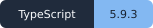</a>
  <a href="https://vite.dev/">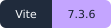</a>
  </p>
  <p>
  <a href="https://threejs.org/">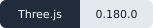</a>
  <a href="https://r3f.docs.pmnd.rs/"></a>
  <a href="https://pmndrs.github.io/react-three-rapier/"></a>
  </p>
</div>

Learn React from scratch while exploring a spacious 3D learning home. React Quest combines **15 chapters, 56 exercises, 18 skills and 9 projects** with an interactive world: study at the computer, earn XP, grow flowers, read React books and unlock the home arcade.

The course library contains **70 teaching sections**, chapter learning goals, runnable examples and 15 optional self-checks with explanations. Search in Persian or English, open any section or chapter exercise, and resume your last reading position in the same browser. Advanced lessons include working Redux, React Query, routing, API error handling, Testing Library and project examples. Reading and self-checks do not award exercise credit.

> **Learn → Practice → Build → Debug → Master**

## A look inside

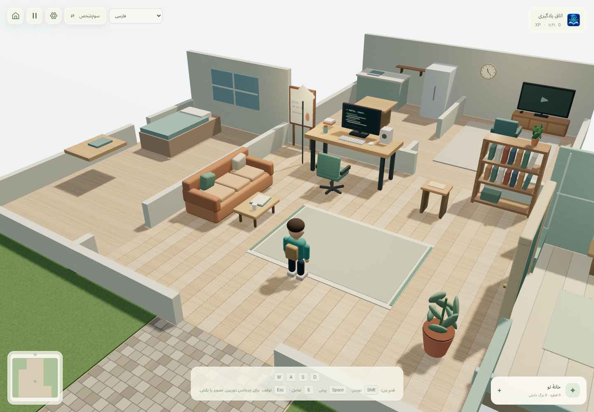

*Your learning home: walk to the computer, read on the sofa and grow a garden with completed exercises.*

| Learn at the computer | Write and run real React |
|---|---|
| [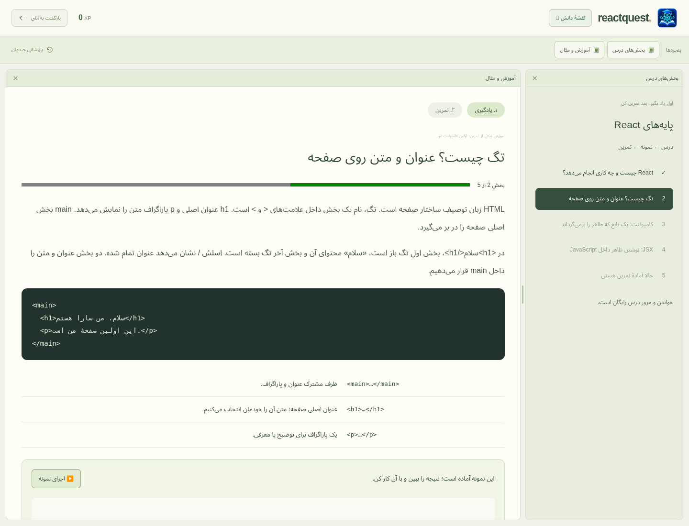](docs/images/computer-lesson-fa.png) | [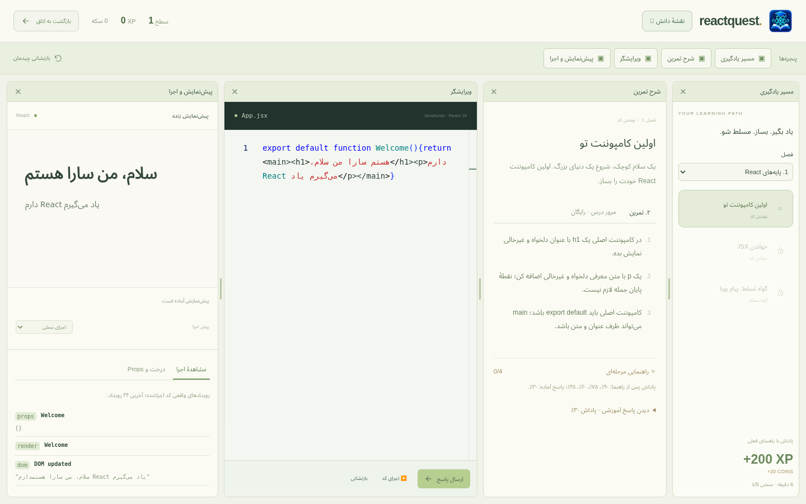](docs/images/computer-workspace-fa.png) |
| Read a short explanation and try an ungraded example. | Edit JSX, run the preview and submit behavioral tests. |

<details>
<summary><strong>Open the knowledge map</strong> · chapters, projects and mastery</summary>

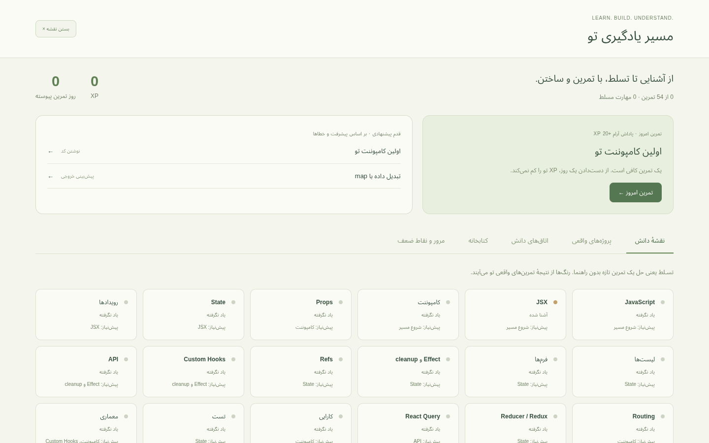

</details>

*Screenshots show the actual application with the Persian interface. English is also available in settings. Click a lesson or workspace image to view it at full size.*

## Built with

**Interface and state**

<p>
  <a href="https://react.dev/"></a>
  <a href="https://chakra-ui.com/"></a>
  <a href="https://redux-toolkit.js.org/">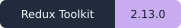</a>
  <a href="https://reactrouter.com/"></a>
</p>

**3D world and physics**

<p>
  <a href="https://threejs.org/"></a>
  <a href="https://r3f.docs.pmnd.rs/"></a>
  <a href="https://drei.docs.pmnd.rs/">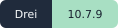</a>
  <a href="https://pmndrs.github.io/react-three-rapier/"></a>
</p>

**Learning lab and tooling**

<p>
  <a href="https://microsoft.github.io/monaco-editor/"></a>
  <a href="https://tanstack.com/query/latest">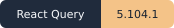</a>
  <a href="https://www.typescriptlang.org/"></a>
  <a href="https://vite.dev/"></a>
  <a href="https://pnpm.io/">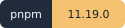</a>
</p>

Versions show the exact application resolutions in [`pnpm-lock.yaml`](pnpm-lock.yaml), plus the package manager declared in [`package.json`](package.json). The optional WebContainers engine and the generated exercise project are described in the [architecture guide](docs/ARCHITECTURE.md#dependencies). FastAPI and PostgreSQL are planned for a later stage.

**Jump to:** [Quick start](#getting-started) · [Learning](#learn-before-you-practice) · [World and rewards](#explore-and-unlock-rewards) · [Controls](#controls-and-preferences) · [Project docs](#project-documentation)

For developers and fork maintainers: [development setup](docs/DEVELOPMENT.md), [contributing](CONTRIBUTING.md), [testing](docs/TESTING.md), [publishing your fork](docs/DEPLOYMENT.md) and the [documentation index](docs/README.md).

## Getting started

Use Node.js **22.12 or newer** and the declared **pnpm 11.19.0** version. This monorepo uses pnpm workspaces and `workspace:*` dependencies; `pnpm-lock.yaml` is the authoritative lockfile.

```sh
pnpm install --frozen-lockfile
pnpm dev
```

Open [http://127.0.0.1:5173](http://127.0.0.1:5173).

## Learn before you practice

The learning loop is **Learn → Practice → Build → Debug → Master**. You can start from any chapter or go straight to practice. New learners begin with “What is React?” and learn what HTML tags, functions, `return`, `export` and JSX do before answering questions or writing code. Each exercise starts with explanations, annotated examples and runnable, ungraded demonstrations. Lesson progress is saved, and reviewing is free.

- The knowledge map contains chapters, skills, projects, books, reviews and themed rooms.
- Topics include JavaScript, JSX, components, props, state, lists, forms, hooks, APIs, routing, Redux, React Query, performance, testing, architecture and a final project.
- Eight exercise formats cover writing, debugging, predicting, reading, completing, refactoring, adding features and boss challenges.
- The judge checks actual React behavior and relevant source requirements. Personal wording and harmless punctuation differences are accepted when the expected behavior is correct.
- Skills progress from new to introduced, practiced and mastered. Only a fresh assessment completed without hints or a revealed solution grants mastery; old completions migrate as practice.
- Four progressive hints reduce XP to 90%, 75%, 60% and 45%; revealing a solution gives 30%. Assistance survives reload, and mastery assessments have no hints or ready-made solutions.
- Nine projects include a Profile Card, an eight-stage Todo app, Weather, Movie Search, a shop, an Admin Panel a Study Planner, a Project Board and a Budget Dashboard. The next mission continues from the learner's own saved code.
- Execution tools show state, render calls, DOM, props, effects and cleanup, requests, Redux and Query data. The JSX tree is static analysis; component call counts are observations, not production benchmarks.
- Daily practice awards 20 XP once per Tehran calendar day. Spaced reviews, weak areas and recommendations follow learning progress; missed days do not remove XP.
- Nine themed knowledge rooms reuse a shared physical layout. Specialist rooms unlock through mastery.
- The Hooks Boss has seven behavioral checks, including dependencies, cleanup, immutable state and HTTP errors.

Lesson and practice panes can be resized, closed and reopened. Drag a separator to resize, use a pane's × button to close it, and reopen it from the always-visible window toolbar. Reset layout restores the defaults. Separate lesson/practice layouts survive reload without losing drafts or preview state; on mobile, stacked panes have adjustable heights.

## Explore and unlock rewards

The fullscreen world is one spacious home with a learning room, television lounge, kitchen, quiet study, greenhouse and small enclosed courtyard. The playable bounds are approximately **21 × 25 m**. A compact destination menu helps you reach activities without cluttering the world with floating labels.

- Each fully passed exercise grants one knowledge drop. Water a plant to spend a drop and grow lasting blossoms; repeating an exercise gives no extra drop and watering does not spend XP.
- The beginner React book is available immediately. Read on the sofa, turn pages and keep your bookmark; completed exercise topics join your collection.
- After two completed exercises, sit by the television and watch the freeCodeCamp React course. The video is in English, with authored notes in the selected interface language; playback requires internet access and access to YouTube.
- After three completed exercises, collect the key from the desk and use it to open the greenhouse. Garden growth and the opened door are saved.
- At **1000 XP**, the Bug Hunter arcade becomes available inside the home.

Use the destination menu to walk toward an accessible interaction point, then press E or tap the generic interaction prompt that appears nearby. Walking routes respect physical obstacles. The initial movement guide fades after the first movement.

## Controls and preferences

| Action | Keyboard / mouse |
|---|---|
| Walk | W / A / S / D |
| Interact | E near an activity |
| Run | Hold Shift while moving |
| Jump | Space |
| Rotate the camera | Drag with the mouse; touch dragging is also supported |
| Return from the computer / pause | Esc |
| Run code in the editor | Ctrl+Enter |

Android and other touch devices use a circular joystick under the left thumb: drag in any direction and drag farther to move faster. Hold the run button or tap jump with the right thumb while moving, and drag the scene with another finger to look around. Controls fit portrait and landscape screens. Both first-person and third-person views are available from the floating controls or settings.

On the first visit, choose light, dark or server-time appearance; the preference is saved and can be changed in settings. The world uses the server clock in the Tehran time zone, including automatic lighting. Locally generated textures, rounded characters, pitched roofs, detailed windows, vegetation and atmospheric lighting give the neighborhood its visual style.

The application supports **English and Persian**. Automatic language selection uses the visitor's IP country: Iran selects Persian, and other countries select English. Settings and the theme dialog offer a saved manual override. Persian uses RTL and English uses LTR across menus, learning panes and app previews; code remains LTR and the thumb controls retain their physical positions. If country lookup is unavailable, a disclosed browser-language/time-zone fallback is used. No GPS permission is requested, and changing language preserves code, XP and pane layouts.

## Exercise runtime and saved progress

The default runtime uses locally bundled React in an isolated iframe. JSX and interactions run for real, with React Router, Redux Toolkit, React Redux, React Query and Testing Library available in the learning lab. API exercises use deterministic `/api/weather`, `/api/movies`, `/api/users` and `/api/fail` fixtures; no external API keys are needed. Project storage is isolated by project, and evaluation uses separate data and clocks.

Automatic mode and the optional Vite-project engine can use WebContainers. Generated projects also install and run with **pnpm**. This path requires network access and a compatible browser; automatic mode reports connection failures and falls back to local React. Ordinary GitHub Pages hosting does not supply the cross-origin isolation headers required by WebContainers, so use the local engine or automatic fallback there.

Use **Show my creation on this site** in a project workspace or saved project card to run your own app in a large interactive view. Project data and code survive returning to the site in the same browser.

Progress, drafts, rewards, bookmarks and preferences are stored in the current browser. Historic progress migrates without granting unearned mastery. Accounts, a persistent profile backend and an AI Tutor are future work. Development and preview middleware provide server-time and visitor-country endpoints; the application does not yet implement the planned FastAPI/PostgreSQL backend.

## GitHub Pages deployment

The [live demo](https://salehghotbani.github.io/Game-React-Tutorial/) is hosted on GitHub Pages. In **Settings → Pages**, select **GitHub Actions** as the source. The workflow deploys after each push to `main` or a manual Actions run: it installs dependencies with pnpm, runs TypeScript, lint and unit checks, builds `apps/web/dist` and publishes it. The base path comes from Pages configuration instead of a hardcoded repository name. Public repositories can use Pages on GitHub Free; see the [official Pages documentation](https://docs.github.com/en/pages/getting-started-with-github-pages/what-is-github-pages).

Static hosting needs no backend for lessons, Monaco, previews or grading. The clock reads the host's HTTP `Date` and `Age` headers with second-level precision rather than using the visitor's system clock. Country detection uses the browser's IP-country lookup, with manual language selection available.

To create the same static build in PowerShell:

```powershell
$env:VITE_BASE_PATH = '/Game-React-Tutorial/'
$env:VITE_STATIC_HOST = 'true'
pnpm build
Remove-Item Env:VITE_BASE_PATH, Env:VITE_STATIC_HOST
```

## Validation

```sh
pnpm check
pnpm browsers:install
pnpm test:e2e
```

`pnpm check` runs strict TypeScript, zero-warning lint, unit tests and the production build. To use installed Microsoft Edge on Windows:

```powershell
$env:PLAYWRIGHT_CHANNEL = 'msedge'
pnpm test:e2e
```

For production browser checks, run `pnpm build` and `pnpm preview`, then set `PLAYWRIGHT_BASE_URL` to `http://127.0.0.1:4173` in the test terminal. Screenshots and traces are stored under ignored `artifacts/` directories. See [validation evidence and runtime limits](docs/VALIDATION.md).

## Project documentation

- [Documentation index and reading paths](docs/README.md)
- [Development environment](docs/DEVELOPMENT.md) · [فارسی](docs/DEVELOPMENT.fa.md)
- [Contributing](CONTRIBUTING.md) · [فارسی](CONTRIBUTING.fa.md)
- [Testing](docs/TESTING.md)
- [Deployment and forks](docs/DEPLOYMENT.md)
- [Extension recipes](docs/EXTENDING.md)
- [Architecture](docs/ARCHITECTURE.md)
- [Lesson system](docs/LESSON_SYSTEM.md)
- [Product scope](docs/PRODUCT.md)
- [Validation](docs/VALIDATION.md)
- [Development rules](AGENTS.md)

## License

This project's original code and documentation are licensed under the [MIT License](LICENSE), copyright © 2026 Saleh Ghotbani. Third-party dependencies and linked learning resources retain their respective licenses and terms.
