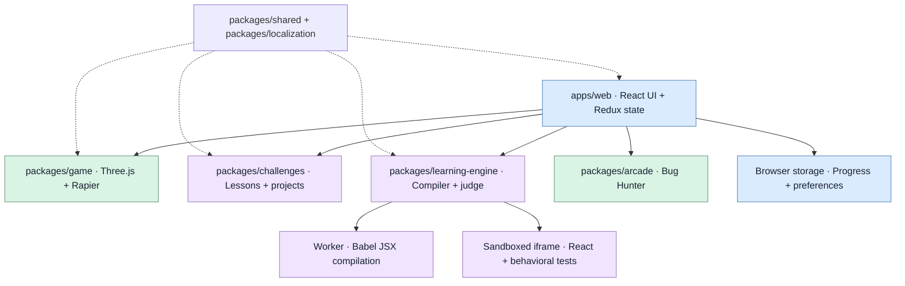

# Architecture

## At a glance

The web application connects three independent layers: the 3D world, learning progression and the isolated React execution lab. Shared contracts and localization keep their interfaces consistent.

See the [game and computer screenshots](../README.md#a-look-inside) or the [Persian guide](../README.fa.md). Authentication and the planned FastAPI/PostgreSQL backend are outside the current implementation.

## Workspace boundaries

| Package | Responsibility |
|---|---|
| apps/web | Router, Chakra provider, bilingual HUD, Monaco workspace, Redux settings/progression |
| apps/api | Reserved FastAPI/PostgreSQL backend |
| packages/game | Scene, procedural geometry, interaction, camera, input and physics |
| packages/shared | GameMode, InteractionObject, Challenge and evaluation contracts |
| packages/localization | Persian/English messages, validated language selection, translation and React subscriptions |
| packages/learning-engine | JSX compiler worker, preview bridge, CodeRuntime and result evaluation |
| packages/challenges | Sequenced beginner lessons, chapter concepts, 56 exercises, skill/room metadata, projects, prerequisites and tests |
| packages/arcade | Pure Bug Hunter engine, question content and its React interface |

pnpm-workspace.yaml owns package discovery; internal dependencies use workspace:*. pnpm-lock.yaml is the only installation lockfile. Workspace packages expose TypeScript sources compiled by Vite. No publishing step is needed.

## Room simulation and interaction

PlayerController owns a Rapier kinematic capsule and camera-relative motion at fixed 60 Hz. `locomotion.ts` supplies sprint speed and integrated vertical velocity; the controller consumes one-shot jump requests, uses Rapier grounding, disables ground snap during ascent, handles ceiling hits and limits falling speed. Holding Space does not auto-jump; airborne requests cannot reset vertical velocity. The 1.8 m capsule matches the rounded avatar, and the model base/eye height derive from its center. Shared ceiling geometry blocks upward movement inside the home; navigation ignores overhead colliders. PlayerModel owns visual rotation, walking, running, jumping and sitting. WorldCamera owns the orbiting follow, first-person view and seated framing. Shared activity poses provide each seat, heading and camera target. PhysicsWorld owns colliders; decorative cutaway walls still have full-height collision boundaries. The arcade collider is conditional on its unlock.

Movement input uses physical key codes and clears on blur/visibility loss. Modes include exploration, computer entry/learning, arcade, reading and TV entry/watching. Entering the computer or TV saves the return position, freezes movement, seats the model and moves the camera toward the activity. Exiting restores the saved position. Physics pauses behind learning, arcade, reading and cinema interfaces.

GamePage builds an interaction registry and chooses the nearest object within its radius. Game rendering imports no editor or execution library. Monaco, Babel and the lesson UI load on demand; the arcade has no Three.js dependency. Per-frame physics uses refs, and map telemetry is sampled rather than dispatched every frame.

## Room life and navigation

Room rewards are derived from validated `completedLessons`, not stored XP. The additive version-3 `roomLife` profile records unique watered exercise IDs, key collection, greenhouse opening and bounded book bookmarks. Restoration intersects consumed drops/book access with reachable completions and rejects keys/doors without earned prerequisites. Reducers enforce the same earn → collect → open order and make repeat watering without another completed exercise a no-op. Reading and watching do not alter lesson completion, assistance or XP.

`getRoomColliders` is shared by Rapier and the navigation grid. The default east wall blocks the greenhouse; opening the door replaces it with two wall segments and an open-door collider. The annex's outer walls remain present while locked, preventing entry from the courtyard. A pure breadth-first grid route expands furniture footprints by the player radius. The controller walks along that path through the actual Rapier character controller; manual input cancels it and a stuck timeout stops an obstructed route. No navigation button teleports the player.

The new reading, enteringTV and watching modes freeze exploration input. TV entry saves the return position, seats the player, changes heading and smoothly frames the lounge before showing the cinema dialog; exit restores the saved walking position. Native modal dialogs provide keyboard focus containment. The authored books share teaching definitions without importing the code runtime/editor. The external video iframe is created only after explicit playback, uses YouTube's privacy-enhanced host with a credentialless attribute for the isolated page and is removed on exit. Persian notes and source links remain available independently. Streaming is not simulated as a successful offline video.

`RoomLife.tsx` uses existing Three/R3F/Drei primitives for rounded furnishings, procedural flowers, watering particles, the hinged door and garden furnishings. Growth and unlock state are passed into rendering; no new package is required. The greenhouse is a physical extension of each themed studio, independent of the freely selectable study themes.

The studio's visible foundation is 10×10 m, matching its floorboards and meeting adjacent floor slabs at ±5 m without overlapping their coplanar top faces. Physics boundaries retain their existing dimensions. `KnowledgeShelf` mounts the earned decorative books on the kitchen's full-height rear wall with visible brackets; book bottoms meet the shelf top. Its support remains visible in both camera modes, including the third-person wall cutaway.

## Home, camera and clock

`world/layout.ts` describes the rooms, courtyard, physics geometry and bounds. Third-person walls use cutaways while first-person walls retain height. Rendering is split into the main room, retained house rooms, lighting and primitives. Interaction logic lives in `useRoomActivities` outside rendering; opening learning interfaces pauses physics.

`useCameraLook` captures mouse/touch dragging on the canvas and holds separate first-person and orbital yaw/pitch values in a ref. First-person camera positioning is at eye height with the avatar hidden; third-person positioning uses a bounded spherical orbit. Manual movement uses the current view's yaw. Activity poses seat the player at the computer, sofa or relocated television and save/restore the actual approach. Camera preference is a separate validated localStorage value; resets and theme visits preserve it.

`ThemePicker` asks first-time visitors to select light/dark/auto in a native focused dialog. `gameSlice` validates and retains this choice with a separate `react-quest-theme-v1` preference. `appearance.ts` resolves interface and scene daylight from the selected mode and server timestamp; `useAppearance` applies root color-scheme/theme classes, while the renderer consumes the same mode. `AppearanceContext` supplies the resolved scheme to Monaco, whose light/dark themes can change without resetting the learner's model. The clock always retains server time. Selection and settings panels pause physical input. Existing browser regressions seed an already-chosen automatic preference; dedicated first-visit tests use empty storage.

`SurfaceProvider` owns shared deterministic local canvas textures and disposes them on unmount. Color textures use sRGB; bump/roughness maps remain linear. `useBoxGeometry` scales face UVs by their physical dimensions, so surface detail does not stretch across buildings and floors. `HumanFigure` shares rounded anatomy and material definitions between the avatar and residents. Houses, trees and street detail have focused rendering components; leaves and grass use instanced geometry. Sky/stars and PBR materials use the installed Three/Drei stack without external asset requests or new dependencies.

The HUD is floating markup rather than a top navigation bar. The learning map, compact status, destination dock, mini-map and mobile direction pad remain accessible. The controller reports its first corrected horizontal movement or successful jump once, allowing the guide to fade after actual movement rather than an intercepted keypress.

`serverTimePlugin` exposes a non-cacheable read-only `/api/time` response in both Vite development and production preview. `useServerClock` estimates request transit, anchors the server timestamp to `performance.now()` and resynchronizes every minute/on visibility return. It keeps the last monotonic estimate and marks lost synchronization instead of silently substituting the browser's Date clock. Pure Tehran-time conversion drives the analog hands and light cycle. Server-backed builds supply this same endpoint. Static builds instead use same-origin HTTP response headers as described below; neither path implements the reserved FastAPI/authentication backend.

The earned arcade inside the home reuses lazy Bug Hunter and the existing score recorder. XP remains derived from successful completion receipts.

## Language selection and localization

`packages/localization` contains a checked-in English message catalog keyed by canonical Persian authored text. Presentation uses `tx` for text/accessible labels and a small `useSyncExternalStore` subscription for locale changes, including the separate R3F tree. Exact messages and bounded dynamic templates cover UI, curriculum, books, arcade and runtime feedback. Numbers, React elements, runtime data and learner code are not transformed. Canonical challenge IDs, answer indexes, tests and reward contracts remain language-independent. `translateAuthoredCode` translates known authored snippets/examples only; saved drafts always take priority, and fresh English starters are saved before judging. Compilation checks verify all translated runnable examples and starter analysis against the original. Canvas signs regenerate textures when language changes.

`LocaleProvider` resolves a validated manual `react-quest-language-v1` preference first. Otherwise `detectCountry` asks `/api/locale`, supplied in Vite dev/preview by `visitorLocalePlugin` from CF-IPCountry or X-Vercel-IP-Country hosting headers. The endpoint returns only country/null with private no-store caching and never geolocates the server as the visitor. An unknown response falls back to a credential-free browser fetch of https://api.country.is/, which reports the caller's IP country. Each request has a four-second timeout and aborts on unmount/selection changes. No IP, coordinates or automatic country decision is persisted. Unavailable lookups use a disclosed browser-language/time-zone fallback. Independently hosted static builds should provide `/api/locale` from their trusted edge country data; the client lookup remains a fallback. IP-country information is for appearance/language only, not authorization.

The provider sets HTML lang/dir, title and description. Locale CSS adjusts LTR text and pane flow while preserving LTR code/map/control geometry. Splitter pointer and keyboard deltas follow the current text direction; pane IDs and stored sizes remain stable. Manual selection is available from settings and the first theme dialog; a compact desktop selector is hidden on mobile, where the settings selector remains accessible. Movement and E interactions ignore typing targets, including the language selector. This adds one local workspace package that reuses the installed React peer, with no new external runtime dependency. The frozen pnpm installation was verified.

## Lesson runtime and state

CodeRuntime attaches to an iframe, compiles in a disposable worker, runs an engine and requests behavioral evaluation over a source-checked message channel. Auto mode attempts WebContainers, then reports its failure reason before falling back to bundled local React. Explicit WebContainers mode surfaces its error instead of falling back. Vite virtual modules bundle the local React runtime and preview bridge without CDN script dependencies.

Pure evaluation combines runtime results with compiler-derived component/hook evidence. Redux receives completion events only after evaluation. The reducer gates submissions on teaching/practice entry and validates test IDs, mandatory results and the exact current draft; completion receipts derive hint-adjusted XP/coins, so stored totals are not trusted. Version 3 localStorage also restores lesson steps and completed teaching, and versions 1/2 migrate passed exercises as learned. It restores valid completed exercise IDs, including mid-course work, bounded drafts, assistance, answers, review history and project data; version 1 migrates in place as practice. The same reducer keeps mastery earned while room visits remain freely selectable. Game settings and runtime processes are separate from persistent progress.

## Resizable learning workspace

`ResizableWorkspace` owns the lesson and practice pane layout using React, CSS flex sizing and Pointer Events; it imports no Chakra splitter or additional dependency. `workspaceLayout.ts` fits saved weights to the current viewport, enforces minimum sizes and changes only the two panes adjacent to a dragged separator. Desktop dragging follows RTL geometry. Separators support arrow keys, Shift for larger steps, Home/End limits, Enter to close the primary pane and Escape to cancel a drag. Pointer capture and a temporary drag overlay keep iframe contents from interrupting resizing.

Each pane has a close button. The toolbar can reopen individual panes or reset the complete layout, including an all-closed state. Hidden panes remain mounted to preserve Monaco drafts/undo and live React preview state; submission also works while the preview is hidden. Teaching and practice preferences use separate `react-quest-workspace-v1:*` localStorage entries, independent of learning progress. At widths below 1100 px, panes stack vertically with resizable heights and a scrollable viewport; horizontal and vertical preferences are stored separately. ResizeObserver adapts pane sizes to viewport changes.

## Dependencies

These badges show exact versions resolved in `pnpm-lock.yaml`; pnpm is declared in `package.json`. Version ranges in workspace manifests may be broader. Refresh the badges when the lockfile changes.

| Layer | Versions | Responsibility |
|---|---|---|
| Application |        | Component runtime, strict typing and application build |
| UI and state |        | UI provider, routing and typed application state |
| 3D rendering |        | Procedural world, scene components and rendering helpers |
| Physics |  | Kinematic movement, character control and collisions |
| Learning editor |     | Locally bundled JSX editor and worker-based compilation |
| Learning libraries |  | Actual Query cache exercises and observations |
| Optional runtime |  | Browser Node runtime, filesystem and Vite process |
| Workspace |  | Installation, workspace scripts and generated projects |

Chakra uses Emotion, and Redux Toolkit uses React Redux. The isolated preview also bundles React Router, React Redux and Testing Library for real learner-authored behavior tests. esbuild bundles the local preview/bridge at build time; Vitest and the Rapier development runtime validate domain rules and real colliders, while Playwright checks browser behavior. These dependencies support the existing editor, teaching or game responsibilities; game rendering imports no lesson runtime or editor library.

The generated challenge project pins React/React DOM **19.2.0** and Vite **6.4.1** independently from the application's locked React/Vite versions above. The local preview uses the application's bundled libraries. Large physics, editor and language-worker chunks are expected; heavy lesson dependencies are lazy loaded.

## Home bounds and personal creations

`world/layout.ts` bounds the environment to one home and its courtyard. Streets, external buildings, residents, terrain decoration and vehicle simulation are removed. Rendering, Rapier and walking routes use the same retained room geometry. The route grid stays aligned to zero when bounds change; the key console leaves a clear path to the bookshelf even with the arcade unlocked.

No object marker HTML is mounted by the renderer. `GamePage` displays one generic E interaction prompt only for the nearest in-range object, retaining a descriptive accessible name. The destination dock provides optional walking assistance.

All valid challenges and study themes can be selected directly. Prerequisites only guide recommendations and daily suggestions. Teaching sections can be read out of order; `startPractice` explicitly opens practice without awarding completion, XP or mastery. Completion still validates current draft, quiz answers and required test results. Restoration accepts valid mid-course completion and never fabricates earlier work.

`builds.ts` supplies two independent final-chapter assessments and reference solutions for browser validation. `ProjectShowcase` runs a snapshot of the saved learner draft through `CodeRuntime` in a native modal dialog and an opaque sandboxed iframe. It restores and saves storage under the project ID and never invokes completion or evaluation. Saved project cards reopen the highest saved mission after reload; the workspace preview button opens the current draft. Closing/escape disposes the runtime and contains keyboard interaction within the dialog. No new dependency is required.

## GitHub Pages deployment

`.github/workflows/deploy-pages.yml` validates TypeScript, lint and unit tests before building the pnpm workspace and deploying `apps/web/dist` through the official Pages artifact/deployment actions. The build job has read-only repository permissions; only the deployment job receives Pages/id-token write access. Pages must be configured with GitHub Actions as its publishing source. Node 24 and the package's declared pnpm version are used; action revisions are pinned. Build output, dependency stores, browser artifacts and environment files remain ignored by Git.

`VITE_BASE_PATH` controls Vite's base path, BrowserRouter's basename, the icon and locally bundled worker/lazy assets. The workflow obtains this from `configure-pages`, supporting both project subpaths and root/custom-domain sites. Current application navigation stays on the single root route; internal lesson/project tabs do not create server routes.

`VITE_STATIC_HOST=true` selects static hosting behavior. `fetchServerTime` makes a cache-busted, no-store HEAD request to the site's own `index.html`, reads the server's HTTP `Date` and adds the CDN's `Age` when present. This clock has second precision, plus network transit uncertainty. Missing/invalid headers mark synchronization unavailable; the browser's wall clock is never substituted. Each synchronization uses its own abort controller so an older request cannot overwrite a newer anchor or cancel a newer request. Static country detection skips the nonexistent hosting API and uses the existing browser IP-country lookup and disclosed offline fallback.

The default bundled local React engine, Monaco, compiler workers and behavioral judge need no HTTP API or cross-origin isolation. GitHub Pages cannot run the optional WebContainers engine without its required isolation headers; auto mode reports the reason and uses local React. No isolation service worker, third-party proxy, dependency or backend is added. YouTube playback and external IP-country detection retain their existing network requirements.

References: [Vite static deployment](https://vite.dev/guide/static-deploy.html), [GitHub Pages workflows](https://docs.github.com/en/pages/getting-started-with-github-pages/using-custom-workflows-with-github-pages), [HTTP Date](https://developer.mozilla.org/en-US/docs/Web/HTTP/Reference/Headers/Date), [HTTP Age](https://developer.mozilla.org/en-US/docs/Web/HTTP/Reference/Headers/Age).

## Checks

`pnpm check` runs typecheck, lint, domain tests and production build. `pnpm test:e2e` reuses or starts Vite; PLAYWRIGHT_CHANNEL selects an installed Edge/Chrome. The browser suite enables software WebGL. Screenshots/traces, install cache and build output are ignored.

`pnpm preview:static` runs `scripts/serve-static.mjs`, a Node-only loopback file server for `apps/web/dist`. Its base-path/port arguments permit testing a subpath build without Vite's API middleware or isolation headers. It validates paths within build output and needs no new dependency. Contributor setup, test selection and fork deployment are documented in [the documentation index](README.md); GitHub issue/PR templates collect reproducible behavior and actual validation results. The existing workflow publishes `main` and does not run on pull requests.

## References

- https://www.w3.org/WAI/ARIA/apg/patterns/windowsplitter/
- https://react.dev/learn
- https://webcontainers.io/guides/quickstart
- https://webcontainers.io/guides/configuring-headers
- https://github.com/suren-atoyan/monaco-react
- https://github.com/pmndrs/react-three-rapier
- https://rapier.rs/docs/user_guides/javascript/character_controller/
- https://country.is/

## pnpm tooling

Scripts invoke the installed CLI through Node when a Windows package-bin launcher is unreliable (the browser test/install commands); the public workflow remains pnpm. Store/cache/state directories are workspace-local and ignored. esbuild is explicitly allowed in pnpm-workspace.yaml because the preview build needs its native binary. A frozen install was verified after importing the old exact resolutions; package-lock.json was removed.

The root explicitly declares `@types/babel__core` for the compiler's typed Babel plugin, and the learning-engine package declares the challenges workspace as a development dependency for its evaluation tests. These declarations keep fresh pnpm installs independent of leftover npm modules; they reuse the existing locked versions and add no runtime library.
