# Development guide

**English** · [فارسی](DEVELOPMENT.fa.md) · [Documentation index](README.md)

This guide takes a new checkout from installation to a working development environment. To submit changes, also read [Contributing](../CONTRIBUTING.md).

## Requirements

| Tool | Requirement |
|---|---|
| Git | Clone the project and manage branches |
| Node.js | 22.12 or newer; Node 24 matches the publishing workflow and verified environment |
| pnpm | **11.19.0**, as declared in the root `packageManager` field |
| Browser | A modern desktop browser with WebGL; Edge is used for the documented Windows checks |
| Browser test binaries | Only needed for Playwright, not for ordinary development |

No backend, database, Docker, Python, account or API secret is needed. Package installation needs registry access. YouTube playback, IP-country lookup and optional WebContainers use external services; bundled React grading does not depend on those services after the application assets have loaded.

If Corepack is available with your Node installation, it can install the pinned package manager:

```sh
corepack enable pnpm
corepack install --global pnpm@11.19.0
node --version
pnpm --version
```

If Corepack is unavailable, follow the [official pnpm installation guide](https://pnpm.io/installation) and select version 11.19.0 explicitly. Do not assume the current latest pnpm version matches this repository. See [Corepack's installation and version selection](https://github.com/nodejs/corepack) for systems where its shims need configuring.

## Clone and run

For a local evaluation, clone the upstream repository:

```sh
git clone https://github.com/salehghotbani/Game-React-Tutorial.git
cd Game-React-Tutorial
pnpm install --frozen-lockfile
pnpm dev
```

For contributions, clone your own fork instead; [Contributing](../CONTRIBUTING.md) explains `origin`, `upstream` and branches.

Open [http://127.0.0.1:5173](http://127.0.0.1:5173). Keep the dev terminal running. Vite prints the actual address if the default port is busy; use that address for browser tests as well.

On first entry, select an appearance and, if needed, your language. Walk to the computer with WASD/E or use the destination dock. Finish the explanation, run an example, then complete the first exercise. A correct first exercise gives 200 XP. Reload to confirm that progress is saved. This is a useful manual smoke check before changing code.

No `.env` file is required. Run commands from the repository root. Packages expose TypeScript sources directly, so changing a workspace package is picked up by Vite without separately building or publishing that package.

## Everyday commands

| Command | Purpose |
|---|---|
| `pnpm dev` | Development server, normally port 5173 |
| `pnpm typecheck` | Strict TypeScript without emitted output |
| `pnpm lint` | ESLint with zero warnings allowed |
| `pnpm test` | All Vitest domain/compiler/state/physics tests |
| `pnpm build` | Production output in `apps/web/dist` |
| `pnpm preview` | Vite production preview, normally port 4173 |
| `pnpm preview:static /Game-React-Tutorial/` | Plain static preview on port 4180 for a matching subpath build |
| `pnpm check` | Typecheck, lint, unit tests and production build |
| `pnpm browsers:install` | Install Chromium for Playwright |
| `pnpm test:e2e` | Browser scenarios; includes longer curriculum sweeps |

See [Testing](TESTING.md) for focused scenarios, installed Edge, production tests and static-host verification. `pnpm preview` includes development middleware and isolation headers; `pnpm preview:static` deliberately serves only built files.

## Source map

| Location | Responsibility and starting files |
|---|---|
| `apps/web/src/main.tsx` | React root, StrictMode, Chakra, Redux, locale provider and router |
| `apps/web/src/pages/GamePage.tsx` | Connect the world, interactions, lesson UI and state |
| `apps/web/src/components/` | Teaching, Monaco workspace, splitters, HUD, settings, books, cinema and café |
| `apps/web/src/store/` | `gameSlice.ts` for transient modes; `progressSlice.ts`, `progression.ts`, `roomLife.ts` for learning and persistence |
| `apps/web/src/hooks/` | Room activities, appearance and synchronized server clock |
| `apps/web/src/i18n/` | Visitor-country lookup, preference selection and HTML language/direction |
| `apps/web/*Plugin.ts` | Vite's preview bundles, clock and visitor-country middleware |
| `packages/game/src/` | `GameScene.tsx`, controllers, camera, simulation, world, materials and vehicles |
| `packages/challenges/src/` | Exercise registry, chapters, teaching, skills and incremental projects |
| `packages/learning-engine/src/` | Compiler workers, runtime orchestration, iframe bridge and evaluation |
| `packages/localization/src/` | `en.json`, message translation and authored-code translation |
| `packages/shared/src/index.ts` | Shared TypeScript contracts and behavioral test DSL |
| `packages/arcade/src/` | Bug Hunter logic, questions and React UI |
| `apps/api/` | Reserved backend documentation; no running API or workspace package yet |
| `tests/e2e/` | Real browser learning, movement, localization, rewards and driving scenarios |
| `.github/` | Pages workflow and issue/pull-request templates |

Internal package names use `@react-quest/*`; dependency declarations use `workspace:*`. There are no separate package distribution builds. [Architecture](ARCHITECTURE.md) explains the boundaries in detail.

## Follow the two main flows

```mermaid
flowchart LR
  Input[Keyboard / touch / destination] --> Player[Player or vehicle controller]
  Player --> Physics[Rapier fixed-step simulation]
  Physics --> World[World and camera]
  World --> Activity[Nearby interaction]
  Activity --> Teaching[Teaching screen]
  Teaching --> Editor[Practice and Monaco]
  Editor --> Worker[Compiler worker]
  Worker --> Frame[React iframe and behavioral bridge]
  Frame --> Judge[Evaluation]
  Judge --> Progress[Validated progression reducer]
  Progress --> Rewards[XP / plants / keys / unlocks]
```



The game package does not import Monaco or the lesson runtime. Rendering consumes validated state; rewards are awarded by reducers after canonical checks and exact draft/question snapshots. Per-frame simulation uses refs rather than dispatching Redux actions on every frame. Read [Lesson system](LESSON_SYSTEM.md) before changing compiler, grading or teaching behavior.

## Configuration and local services

| Setting | Default | When to change it |
|---|---|---|
| `VITE_BASE_PATH` | `/` | Build for a repository subpath or another hosting prefix |
| `VITE_STATIC_HOST` | Unset | Set exactly `true` when serving built files without Vite middleware |
| `PLAYWRIGHT_CHANNEL` | Bundled Chromium | Use `msedge` or another installed supported browser channel |
| `PLAYWRIGHT_BASE_URL` | `http://127.0.0.1:5173` | Test an existing preview server or a different development port |
| `PLAYWRIGHT_STATIC_HOST` | Unset | Set `true` only for `pages.spec.ts` on a plain static build |
| `CURRICULUM_IDS` | All exercises | Comma-separated IDs for the Persian curriculum sweep in `education.spec.ts` |

Vite configuration is read at startup/build time; restart after changing it. `VITE_*` values are build configuration exposed to browser code, so they are not a place for secrets. Keep one-off settings in the terminal and clear them before returning to ordinary development. See [Vite's environment documentation](https://vite.dev/guide/env-and-mode) for loading rules.

Vite dev and preview provide `GET /api/time` with a finite `timestamp` and `timeZone`, and `GET /api/locale` with `country` or `null`. Country headers can be simulated locally:

```sh
curl http://127.0.0.1:5173/api/time
curl -H "CF-IPCountry: IR" http://127.0.0.1:5173/api/locale
```

In Windows PowerShell, `Invoke-RestMethod` is an alternative:

```powershell
Invoke-RestMethod http://127.0.0.1:5173/api/time
Invoke-RestMethod http://127.0.0.1:5173/api/locale -Headers @{ 'CF-IPCountry' = 'IR' }
```

The simulated `/api/weather`, `/api/movies`, `/api/users` and `/api/fail` lesson APIs live inside the preview bridge. They are not endpoints of the Vite server or a future FastAPI service. On static hosting, the clock reads HTTP headers and language lookup skips the nonexistent `/api/locale` endpoint.

## Browser state and debugging

Use browser DevTools for console errors, failed network requests and Application/Storage. Redux DevTools can inspect mode/progression actions. Enable collision visualization in settings when checking geometry; reset player changes position/mode without deleting learning progress.

| Storage key | Contents |
|---|---|
| `react-quest-progress-v1` | Version-3 profile: drafts, lesson steps, completion receipts, assistance, reviews, projects and room rewards; the stable key migrates older versions |
| `react-quest-language-v1` | Manual `en` or `fa`; automatic selection removes this override |
| `react-quest-theme-v1` | `light`, `dark` or `auto` |
| `react-quest-camera-v1` | First-person or third-person preference |
| `react-quest-workspace-v1:*` | Separate teaching and practice pane layouts |

State belongs to the current origin: localhost, a different port and your deployed fork have separate profiles. Export the progress value in DevTools before clearing it if you need to preserve work. For a clean learner test, use a fresh browser profile or the existing Playwright empty-storage fixtures. Editing stored XP is not a supported unlock path: totals are derived from validated receipts. The car's position is session-only.

## Common problems

| Symptom | Checks and recovery |
|---|---|
| `pnpm` missing or wrong version | Reopen the terminal after installation, check `pnpm --version` and the root `packageManager`; avoid changing the repository pin just to match a global installation |
| Frozen lockfile mismatch | Run from the root and inspect manifest changes. For intentional dependency changes, run `pnpm install` and commit the matching lockfile; do not delete the lockfile |
| Missing type or workspace dependency | Declare it in the owning manifest, then install with pnpm. A dependency left over from another package manager can hide the problem locally |
| Windows `EPERM` or file-rename failure | Stop this checkout's dev/preview/test processes, use the same user account, then retry installation. Check ownership or file locks; avoid mixing elevated and ordinary installs |
| Blank or stale scene after renaming modules | Inspect the first console/network error, stop Vite, and restart with `pnpm dev --force`; avoid names differing only in case, especially on Windows |
| Camera/keys seem stuck | Close the editor/dialog, focus the scene and resume it. Input is cleared on blur/pause and ignores typing fields |
| Scene or browser test cannot render | Check WebGL support and hardware acceleration; Playwright config already requests software WebGL. Missing system browser libraries are a separate installation issue |
| Wrong automatic language | Check a saved manual override, hosting country headers, IP lookup/VPN and the disclosed browser fallback; choose a language explicitly to continue |
| Clock unavailable or permanently dark auto mode | Check `/api/time` on Vite, or same-origin HTTP `Date`/`Age` on static hosting. Explicit light/dark themes remain available |
| WebContainers fails | Select Local React or inspect Automatic mode's fallback reason. Check browser support, external service access and isolation headers |
| Video does not play | Check YouTube/network availability. Authored book/video notes remain usable independently |
| Large build chunks or Rapier init warning | Consult [Validation](VALIDATION.md); distinguish existing upstream advisories from a failed command or a new regression |

Installation cache/store/state directories and browser artifacts are local and ignored. Use pnpm consistently. Do not commit generated output, dependency directories, personal profiles or credentials.

## Next steps

Read [Testing](TESTING.md), [extension recipes](EXTENDING.md), [Contributing](../CONTRIBUTING.md) and [Deployment](DEPLOYMENT.md). The implementation rules are in [AGENTS.md](../AGENTS.md).
